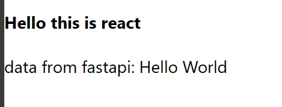

# react

## 실행 - react 경로가 안에 있을 때(nested)
```bash
npm start --prefix [path/to/react/app]
```
위 경우가 아니라 그냥 react 폴더를 열었을 때는 `npm start`만 하면 됨

# fastapi
## 내부에 venv 설정 방법
cd로 경로 이동 한 다음 venv 생성
```bash
C:\Users\[username]\AppData\Local\Programs\Python\Python39\python.exe -m venv .venv
```

다른 것도 전부 cd로 이동한 경로에서 하면 된다.
```bash
.venv\Scripts\python.exe -m pip install fastapi[all]
```
## 실행
```bash
uvicorn fastapi_main:fast_app --reload
```
`fastapi_main`에는 python 파일 이름, `fast_app`에는 FastAPI() instance 변수명이 들어가면 된다.

# 실행 결과
http://localhost:3000/
로 접속하면 된다.
## 24.01.15

